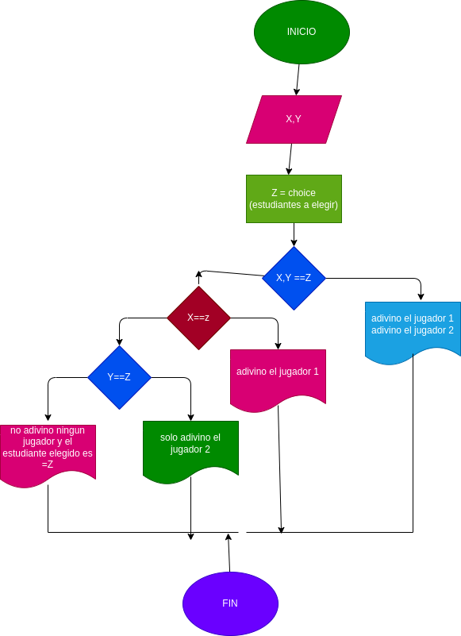

#numero_aleatorio
adivina el numero al azar

# ANALISIS
variables de entrada
X = Jugador uno 
Y = Jugador dos 
Z = nombre del estudiante 

variables de proceso y salida
Adivinaron los dos jugadores
X = solo adivino el jugador uno
Y = solo adivino el jugador dos 

# DISEÑO

